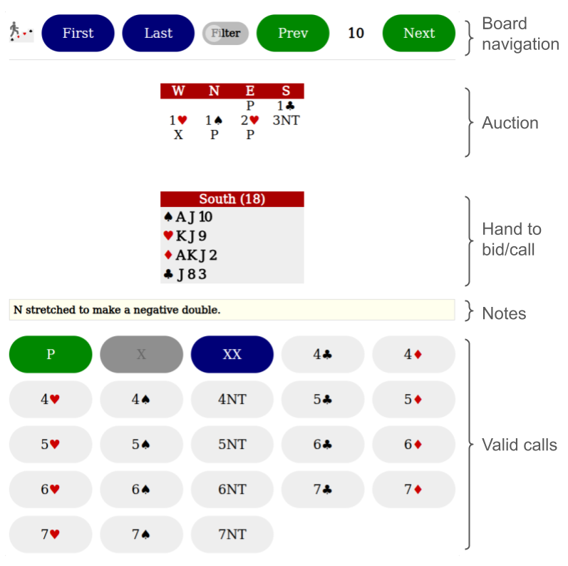
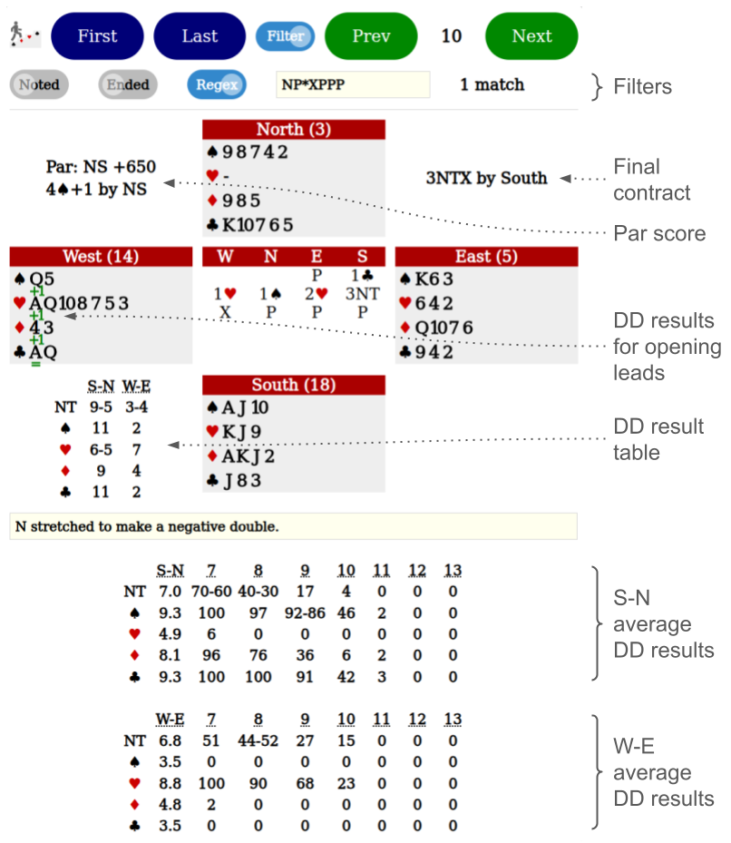

# Bridge Bidding Practice

One player bids all four hands, practicing and tuning any systems.
Click [here](https://macroxue.github.io/bridge-bidding-practice/practice.html)
or any of the images below to get started. Everything runs in the browser locally
on a PC or a mobile device, without any registration.

## Auction

* Navigate up to 1000 boards per browser per device. Boards are stored in the
  browser's local storage. Clearing the local storage erases all boards saved
  with the browser.
* Only the hand to bid/call is shown during an auction.
* Click or tap on a call to retract it and the calls after it.
* Notes can be added to each board.
* Invalid bidding buttons are either greyed out or hidden.

## Analysis

When the auction of a board ends, all four hands are displayed with detailed analysis
to help the player evaluate the auction. The analysis assumes perfect bidding and
card play.
* Par score and par contract(s) assume perfect bidding by all seats.
* Double-dummy (DD) results assume perfect card play by all seats.

Three kinds of DD analysis are performed.
* For opening leads of this contract, shown as green numbers under the leading
  seat's cards. In the picture, 3NT can't be defeated. A club lead holds it to
  three and all other leads result in 3NT+1.
* For contracts in each strain declared by every seat, shown in the DD result
  table. When two seats in a partnership take the same number of tricks, only
  one number is shown; otherwise, two numbers are shown. In the picture, South as
  the declarer of an NT contract takes 9 tricks but North can take only 5 tricks;
  either South or North take 11 tricks when declaring a spade contract.
  Therefore, the best strain to play in is spade rather than NT.
* For average results when defenders' cards are shuffled, shown at the bottom of
  the page. Although such averages don't take the actual auction into account,
  they are closer to single-dummy results. Since the averages are very expensive
  to compute, they're precomputed and retrieved from this
  [double-dummy dataset](https://github.com/macroxue/double-dummy).
  For example, either South or North can take 10 tricks with spade trumps 46%
  of the time, while 3NT can make only 17% of the time. This result still shows
  spade is a better strain than NT. From the numbers, one can also see that
  it's better for South to declare than North. This board is above average for
  South and North, e.g. they take 9.3 tricks on average with spade trumps but
  11 tricks with this board.

## Filtering

When filtering is toggled on, filters below are applied to the boards.
* Noted: auctions with a manually entered note.
* Ended: auctions that have ended.
* Regex: auctions that match a case-insensitive
  [regular expression](https://javascript.info/regular-expressions).

The vocabulary of auctions is limited to 38 calls.
* 35 bids: "[1-7][NSHDC]"
* 3 special calls: "[PXR]" where P, X and R stand for pass, double and redouble
  respectively.

An auction is represented by a simple concatenation of all of its calls.
For example, the auction below is represented by this searchable string
"P1S2DXR2S3DPPP". No spaces are needed as there is no ambiguity.

   | W  | N  | E | S  |
   |----|----|---|----|
   |    |    |   | P  |
   | 1S | 2D | X | XX |
   | 2S | 3D | P | P  |
   | P  |

Below are some regular expressions looking for patterns in auctions.
* "P{4}" or "PPPP": passed out.
* "^P*1[HS]": opening one of a major.
* "^P*1.1[DHS]X": negative double.
* "^P*1([CDHS])X2\1X": responsive double.
* "^P*1([CDHS])2\1": Michaels cuebid.
* "3NPPP": ending with a 3NT contract.
* "NP*XPPP": ending with a doubled NT contract.

